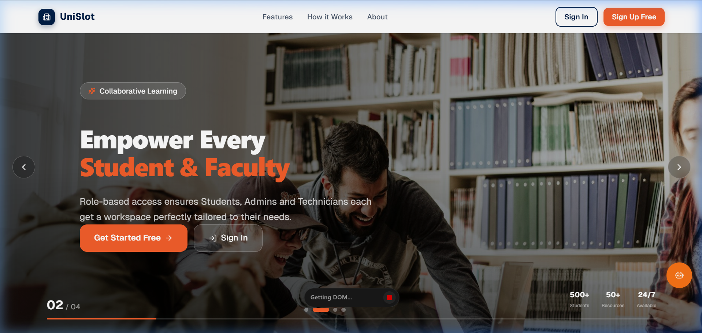
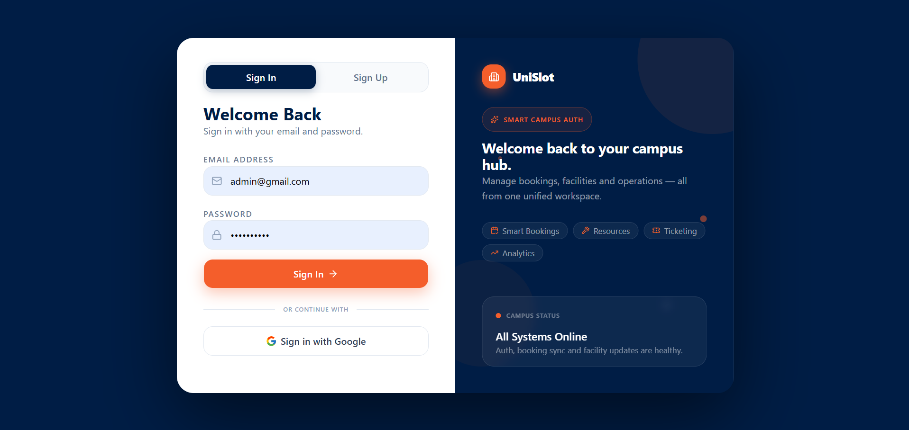
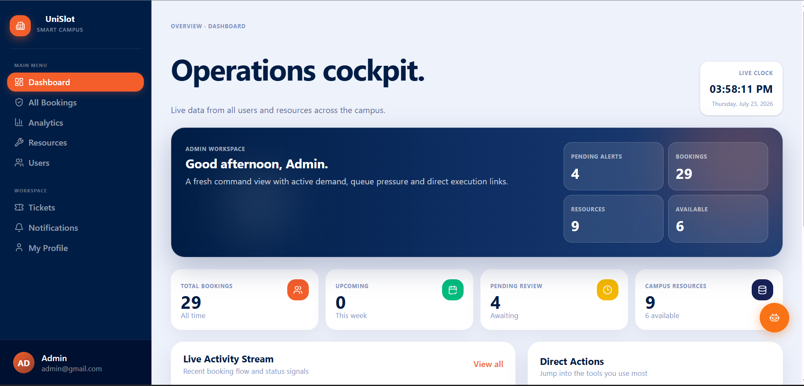
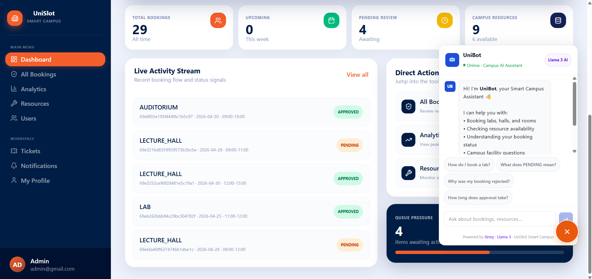
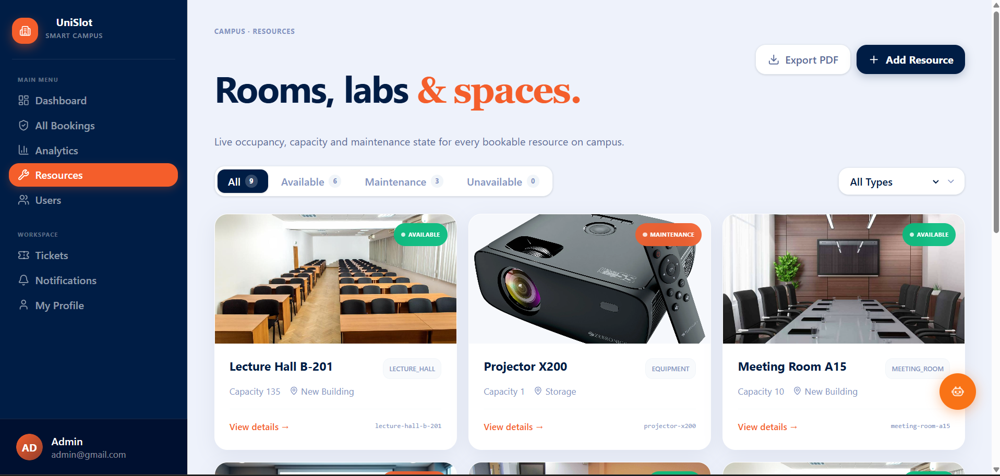
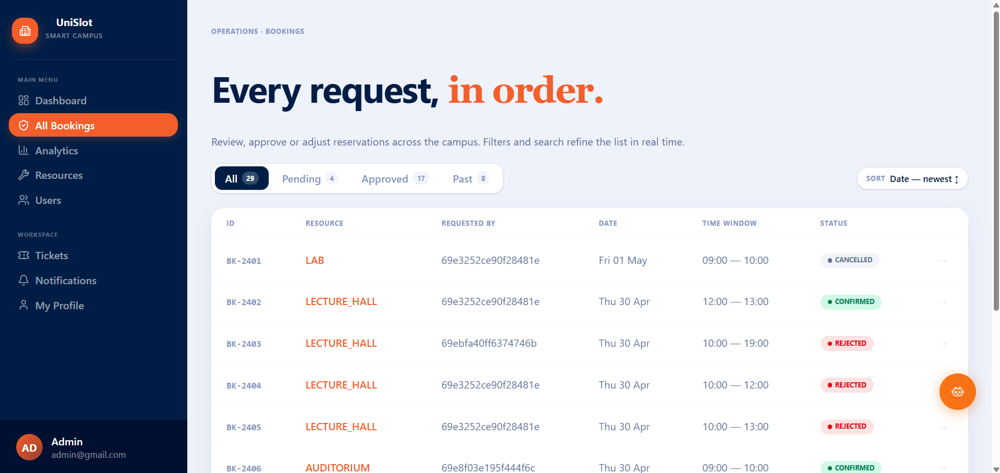
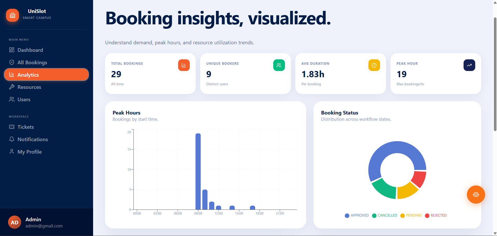
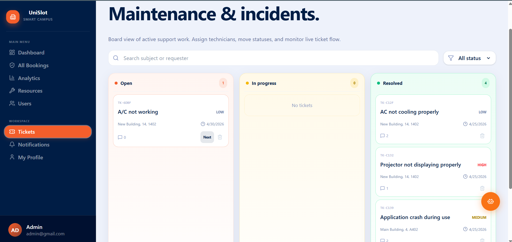
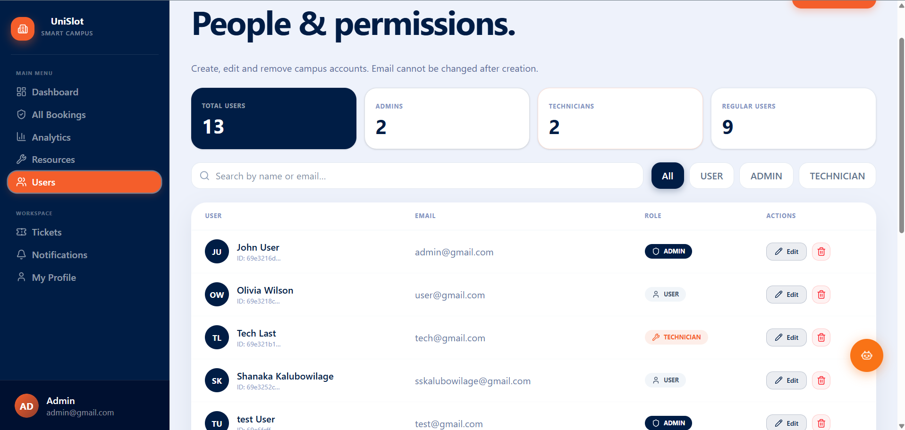
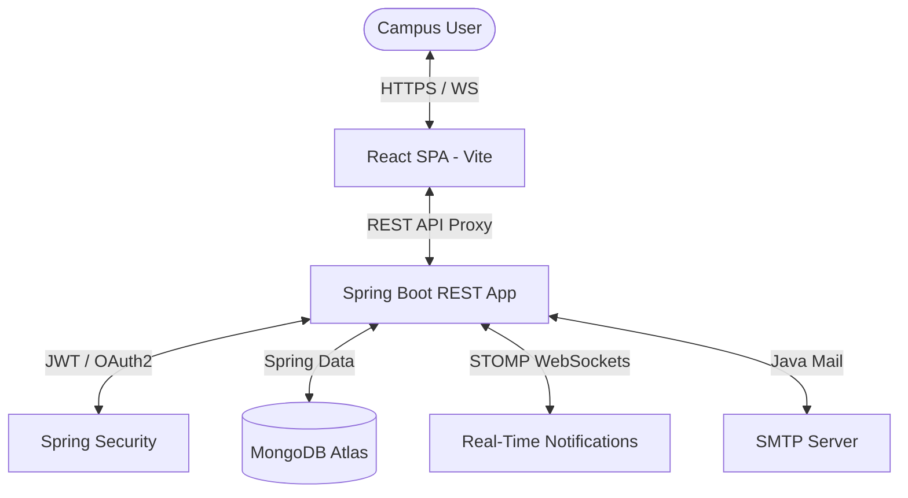

# 🏫 UniSlot: Smart Campus Operations Hub

[](https://www.oracle.com/java/)
[](https://spring.io/projects/spring-boot)
[](https://react.dev/)
[](https://vite.dev/)
[](https://www.mongodb.com/)
[](https://tailwindcss.com/)

**UniSlot** is an enterprise-grade, multi-role campus management platform designed to streamline campus resource scheduling, facility reservations, maintenance ticketing, and real-time operational analytics for modern educational institutions.

---

## 📖 Table of Contents
1. [Screenshots & Visual Tour](#-screenshots--visual-tour)
2. [Key Core Features](#-key-core-features)
3. [Technology Stack](#-technology-stack)
4. [System Architecture](#-system-architecture)
5. [Directory Layout](#-directory-layout)
6. [Getting Started & Local Setup](#-getting-started--local-setup)
7. [API Endpoints Reference](#-api-endpoints-reference)
8. [License & Contributors](#-license--contributors)

---

## 📸 Screenshots & Visual Tour

### 1. Public Landing Page
A dynamic landing page highlighting platform capabilities, statistics, and quick-entry portals.


### 2. Secure Authentication Portal
Dual authentication options using secure local credentials or Google OAuth2 Single Sign-On (SSO).


### 3. Operations Cockpit (Admin Dashboard)
A command center displaying system-wide usage counts, active reservation metrics, live clock, and notifications.


### 4. Live Activity Stream & UniBot AI Chatbot
Check real-time activity trends or ask UniBot, the persistent floating AI Assistant, for immediate help.


### 5. Campus Resource Catalog
A comprehensive list of rooms, labs, and equipment with capacities and status indicators.


### 6. Booking Requests Queue
Admin panel to review, filter, and approve or reject room and equipment booking requests.


### 7. Booking Analytics Dashboard
Interactive analytics visualizations highlighting peak booking hours and distribution graphs.


### 8. Maintenance Tickets Kanban Board
A Kanban-style incident triage board to track system tickets from report to resolution.


### 9. User Directory & Permissions Manager
Role management interface to assign and edit roles (`USER`, `ADMIN`, `TECHNICIAN`) and permissions.


---

## ✨ Key Core Features

* **🔐 Authentication & Role-Based Access Control (RBAC)**: Secure local logins with JWT and OAuth2 integration for Google SSO. Tailored dashboards for `USER`, `TECHNICIAN`, and `ADMIN`.
* **📅 Interactive Slot Reservation**: Prevent scheduling conflicts with interactive calendars and booking pipelines (`PENDING` ➔ `APPROVED` / `REJECTED`).
* **📊 Visualized Campus Analytics**: Track peak booking hours, capacity utilization, and incident rates using interactive **Recharts** visualizations.
* **🛠️ Smart Support Ticketing**: Incident reporting pipeline featuring status permission locks, attachments support, discussion boards with deletion limits, and an **AI SLA Predictive Model** with health score insights.
* **🔔 Real-Time Sync & WebSocket Stream**: Notification alerts pushed instantly via STOMP/WebSocket connections.
* **🤖 UniBot Floating AI Assistant**: Multi-turn conversational chatbot powered by modern LLMs to help users book, query status, or lookup facilities.

---

## 🛠️ Technology Stack

### **Backend (Service API)**
* **Language/Framework**: Java 21, Spring Boot 4.0.3
* **Database**: MongoDB (Spring Data MongoDB & MongoDB Atlas Cloud)
* **Security**: Spring Security, JWT (JSON Web Tokens), OAuth2 Client
* **Messaging**: Spring WebSocket with STOMP protocol
* **SMTP Dispatch**: Spring Mail
* **Build Tool**: Maven

### **Frontend (Single Page App)**
* **Framework**: React 19.2.4 (Vite 8.0.1 environment)
* **Routing**: React Router 7.14
* **Styling**: TailwindCSS v4, Geist Font Family, Lucide Icons
* **State/Networking**: Axios API client, StompJS & SockJS WebSocket clients
* **Charts**: Recharts 3.8.1
* **Toasts**: Sonner

---

## 🏛️ System Architecture



---

## 📂 Directory Layout

```
.
├── backend/                  # Java Spring Boot Backend API
│   ├── src/main/java/        # Source code packages
│   │   └── com/smartcampus/  # Controller, Service, and Entity modules
│   └── src/main/resources/   # App configurations & templates
├── frontend/                 # React Vite Frontend SPA
│   ├── src/components/       # Shared UI Components & Sidebar
│   ├── src/features/         # Modules (Auth, Booking, Tickets, Notifications)
│   ├── src/pages/            # View Pages (Dashboard, Home, Analytics)
│   └── package.json          # Node dependencies & Vite scripts
└── images/                   # Project screenshots & assets
```

---

## ⚡ Getting Started & Local Setup

### 📋 Prerequisites
Before setting up the project locally, make sure you have installed:
* **Java 21 JDK**
* **Node.js** (v18 or higher)
* **Maven** (optional, wrapper is included)
* **MongoDB** (Local instance or MongoDB Atlas account)

---

### ⚙️ Step 1: Run the Backend Server

1. Open your terminal and navigate to the `backend` directory:
   ```bash
   cd backend
   ```

2. Create/update your application environment variables inside `src/main/resources/application.properties` or create an environment file.
   * Configure the MongoDB Atlas connection:
     ```properties
     spring.data.mongodb.uri=your_mongodb_connection_uri
     spring.data.mongodb.database=your_database_name
     ```
   * Set JWT secret key and expiration:
     ```properties
     app.jwt.secret=your_strong_base64_jwt_secret_key_here
     app.jwt.expiration-ms=86400000
     ```

3. Launch the Spring Boot application using Maven:
   ```bash
   # Windows
   .\mvnw.cmd spring-boot:run
   
   # macOS/Linux
   ./mvnw spring-boot:run
   ```
   The backend API will start running on port `8081`.

---

### ⚙️ Step 2: Run the Frontend Server

1. Open a new terminal and navigate to the `frontend` directory:
   ```bash
   cd frontend
   ```

2. Install the package dependencies:
   ```bash
   npm install
   ```

3. Create/update your environment variables in `.env` inside the `frontend` folder:
   ```env
   VITE_GROQ_KEY=your_groq_api_key_for_unibot_chatbot
   ```

4. Start the local development server:
   ```bash
   npm run dev
   ```
   The frontend will start running on port `5173`. Open [http://localhost:5173/](http://localhost:5173/) in your web browser.

---

## 📌 API Endpoints Reference

| Module | Endpoint | Method | Access | Description |
|---|---|---|---|---|
| **Auth** | `/api/auth/login` | `POST` | Public | Authenticate user and return JWT |
| | `/api/auth/signup` | `POST` | Public | Register a new user |
| **Resources**| `/api/resources` | `GET` | Authenticated | Fetch list of all campus resources |
| | `/api/resources` | `POST` | Admin/Tech | Create a new campus resource |
| **Bookings** | `/api/bookings/my` | `GET` | User | Get bookings for current user |
| | `/api/bookings` | `GET` | Admin | Get booking requests for all users |
| | `/api/bookings` | `POST` | User | Request a new resource slot |
| **Tickets** | `/api/tickets` | `GET` | Authenticated | Get all support tickets |
| | `/api/tickets` | `POST` | User | Submit a new support ticket |
| | `/api/tickets/{id}/comments`| `POST` | Authenticated | Add a comment to the ticket |

---

## 📜 License & Contributors

Distributed under the MIT License. See `LICENSE` for more information.

* Developed by **Smart Campus Group 136** for PAF 2026.
